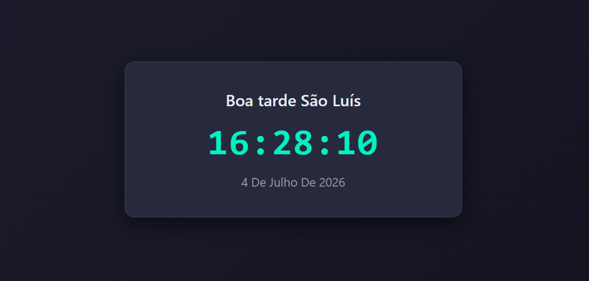

# 🕒 Relógio Digital JS

Um relógio digital desenvolvido com **HTML**, **CSS** e **JavaScript** que exibe a hora em tempo real, a data atual por extenso e uma saudação dinâmica de acordo com o horário do dia.

## 📸 Demonstração

Exemplo:



---

## ✨ Funcionalidades

- ⏰ Exibição da hora em tempo real.
- 📅 Data atual atualizada automaticamente.
- 👋 Saudação dinâmica:
  - Bom dia
  - Boa tarde
  - Boa noite
- 🌍 Exibição da cidade de São Luís.
- 🎨 Interface moderna em tema escuro.
- 📱 Layout responsivo.

---

## 🚀 Tecnologias utilizadas

- HTML5
- CSS3
- JavaScript (ES6)

---

## ▶️ Como executar

1. Faça o download ou clone este repositório:

```bash
git clone https://github.com/jheimisson-barbosa/relogio-digital-js.git
```

2. Abra o arquivo `index.html` em seu navegador.

---

## 📚 Aprendizados

Durante o desenvolvimento deste projeto foram praticados conceitos como:

- Manipulação do DOM
- Objeto `Date`
- Atualização automática com `setInterval()`
- Condições (`if` e `else`)
- Organização de código
- Estilização com CSS

---

## 👨‍💻 Autor

Desenvolvido por **Jheimisson Santos**.

LinkedIn:www.linkedin.com/in/
jheimisson-santos

GitHub: https://github.com/jheimisson-barbosa
